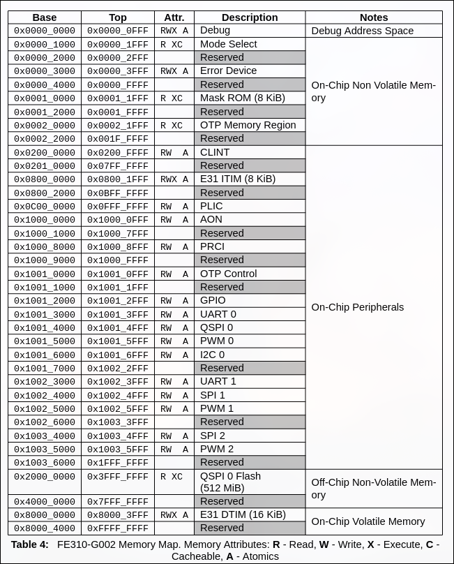

# SparkFun RED-V Thing Plus - SiFive RISC-V FE310 SoC

## Memory Layout

## Reference

### SparkFun RED-V Thing Plus
- Datasheet: https://sifive.cdn.prismic.io/sifive/034760b5-ac6a-4b1c-911c-f4148bb2c4a5_fe310-g002-v1p5.pdf
- sparkfun Software Development Guide: https://learn.sparkfun.com/tutorials/red-v-development-guide
- sparkfun shopping: https://www.sparkfun.com/sparkfun-red-v-thing-plus-sifive-risc-v-fe310-soc.html#content-overview

### Riscv GCC
- https://gcc.gnu.org/onlinedocs/gcc/RISC-V-Options.html
